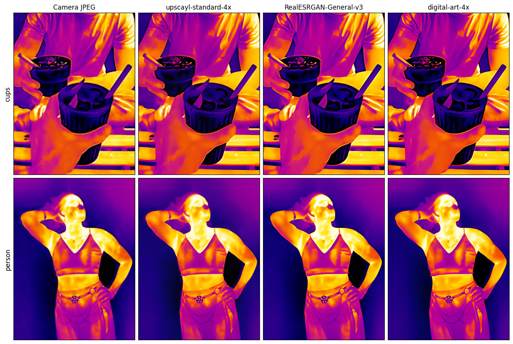
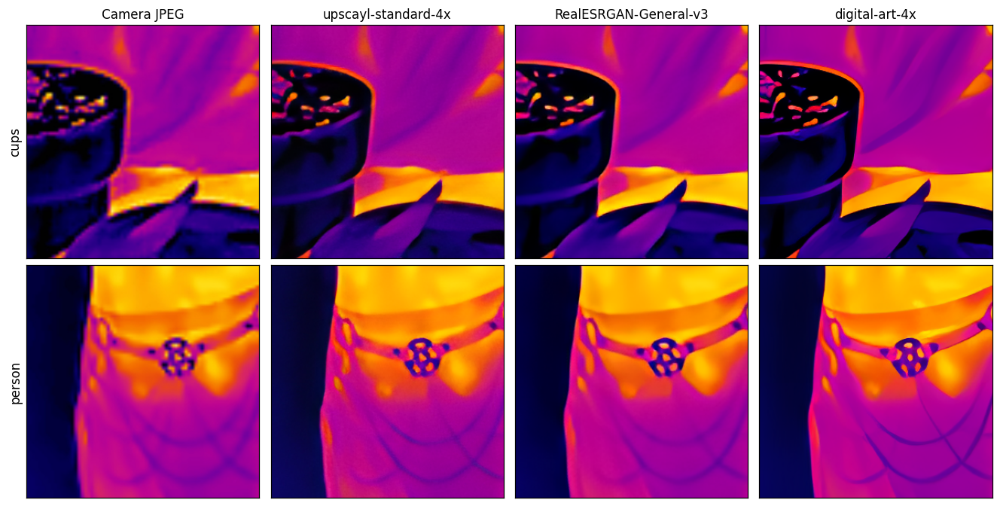

# thermal-upscale

Upscale Thermal Master P3 thermal-camera JPEGs by 4× using [Upscayl](https://upscayl.org/).

The Thermal Master P3 has a 192×256 micro-bolometer sensor and the camera firmware bakes a ~5.83× upscaled 1120×1494 JPEG with edge-enhancement halos. This tool downscales the JPEG back to native sensor resolution (or extracts the raw uint16 thermal data from the JPEG's APP3 segment), optionally applies a Wiener-deconvolution sharpening preprocess, and runs Upscayl's NCNN super-resolution model for a clean 4× output (768×1024).



1:1 crops on the canonical discriminating regions — `upper-cup-rim` (camera-firmware halo around the rim) and `belt-ornament` (~1px hexagonal spokes at sensor resolution):



## Quick start (with `uvx`)

No install needed — [`uvx`](https://docs.astral.sh/uv/guides/tools/) runs the tool in a one-shot environment from this repo:

```sh
uvx --from git+https://github.com/stared/thermal-upscale thermal-upscale photo.jpg
```

Output: `photo_improved.png` next to the input (768×1024).

For repeat use, install it once and call directly:

```sh
uv tool install git+https://github.com/stared/thermal-upscale
thermal-upscale photo.jpg
```

To upgrade later: `uv tool upgrade thermal-upscale`.

## Prerequisites

1. **[Upscayl](https://upscayl.org/) desktop app installed.** The CLI shells out to the bundled `upscayl-bin` and reads the bundled NCNN models. macOS path is auto-detected (`/Applications/Upscayl.app/...`); on Linux/Windows place `upscayl-bin` on `$PATH` with a sibling `models/` directory.
2. **Python 3.13+** (handled automatically by `uv`).

## Usage

```sh
# default — JPEG-path, upscayl-standard model
thermal-upscale photo.jpg

# raw-path with PyTorch-optimized Wiener σ=0.81 + upscayl-lite (=RealESRGAN-General-v3)
thermal-upscale photo.jpg --from-raw

# explicit output path
thermal-upscale photo.jpg out.png

# different SR model
thermal-upscale photo.jpg --model 4xHFA2k

# disable sharpening preprocessing in raw mode
thermal-upscale photo.jpg --from-raw --sigma 0
```

### Defaults

| flag | JPEG mode (default) | `--from-raw` |
|---|---|---|
| output | `<input-stem>_improved.png` | same |
| `--model` | `upscayl-standard-4x` | `upscayl-lite-4x` (= RealESRGAN-General-v3) |
| `--sigma` | `0` (no preproc) | `0.81` (Wiener-deconvolved to match camera-JPEG sharpness) |
| `--cut-percentile` | n/a | `1.0` (clip 1st & 99th percentile) |
| `--colormap` | n/a | `inferno` |

`--keep-intermediate` saves the 192×256 stage next to the output for inspection.

## What's the right pipeline?

- **JPEG-path (default)** is safer: the camera ISP already did bad-pixel correction, non-uniformity correction, and tone-mapping. The Lanczos downscale produces a clean 192×256 input for SR. Slight ISP halos remain.
- **`--from-raw` (experimental)**: bypasses ISP halos by extracting the raw uint16 sensor data from the JPEG's APP3 segments. Exposes the bolometer's fixed-pattern noise — Wiener σ=0.81 sharpens detail to roughly match the camera's gradient energy with about half the camera's halo level on the test set, but FPN can still be visible. Use `--sigma 0` if the noise gets amplified.

## Model picks

From a 14-model sweep on Thermal Master P3 photos (cups, campfire, person — see `LAB_NOTEBOOK.md`):

**Top — default & primary alternatives**

- [`upscayl-standard-4x`](https://github.com/upscayl/upscayl/tree/main/resources/models) — reference. Faithful, no halo amplification. Bundled with [Upscayl](https://upscayl.org/). Slowest (~1.9s).
- [`4xNomos8kSC`](https://github.com/Phhofm/models/releases/tag/4xNomos8kSC) ([NCNN port](https://github.com/upscayl/custom-models/tree/main/models)) — clean & sharp without micro-contrast push. The only real alternative to Standard.
- [`RealESRGAN_General_x4_v3`](https://github.com/xinntao/Real-ESRGAN/releases/tag/v0.2.5.0) ([NCNN port](https://github.com/upscayl/custom-models/tree/main/models)) — soft but faithful; preserves structure, doesn't hallucinate. Fast (~0.4s). Byte-identical to bundled `upscayl-lite-4x`.

**Keep — fallbacks / aesthetic variants**

- [`upscayl-lite-4x`](https://github.com/upscayl/upscayl/tree/main/resources/models) — = `RealESRGAN_General_x4_v3`. Default for `--from-raw`.
- [`high-fidelity-4x`](https://github.com/upscayl/custom-models/tree/main/models) — ≈ Standard, slightly softer.
- [`4xHFA2k`](https://github.com/Phhofm/models/releases/tag/4xHFA2k) ([NCNN port](https://github.com/upscayl/custom-models/tree/main/models)) — painterly, smooths embers without fabricating.
- [`digital-art-4x`](https://github.com/upscayl/custom-models/tree/main/models) — distinct smoother aesthetic.
- [`RealESRGAN_General_WDN_x4_v3`](https://github.com/upscayl/custom-models/tree/main/models) — denoised variant; over-soft.

**Drop — don't re-run**

`ultrasharp-4x`, `remacri-4x`, `ultramix-balanced-4x`, `4x_NMKD-Siax_200k`, `4x_NMKD-Superscale-SP_178000_G`, `4xLSDIRplusC` — either hallucinate textures (ultrasharp invents cup-ridge stripes, NMKD adds grain) or amplify the JPEG halo (remacri).

## Research scripts

`scripts/` contains the diagnostic and parameter-search programs that produced the chosen defaults (sharpness sweeps across 14 SR models, PyTorch optimization of σ against camera-JPEG gradient energy, FPN diagnostics, etc.). They depend on the `[research]` extras (`torch`, `requests`):

```sh
uv sync --extra research
uv run scripts/sharpen_optimize.py
```

See `LAB_NOTEBOOK.md` for the chronological log of findings and decisions.

## License

MIT — see [LICENSE](LICENSE).
